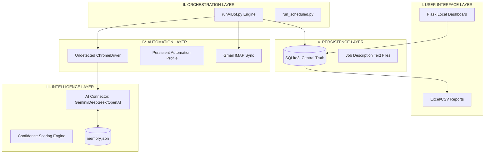

# Naukri_Guru — Technical Architecture & Execution Pipeline

## 1. PROJECT OVERVIEW
**Naukri_Guru** is a high-performance, AI-driven job automation engine designed to dominate the LinkedIn "Easy Apply" ecosystem. It automates the entire lifecycle: from stealth job hunting and intelligent question answering to recruiter email synchronization and cold outreach tracking.

---

## 2. SYSTEM ARCHITECTURE

### A. Modular Layered Design
The system is built on a decoupled architecture to ensure resilience against UI changes and scalability for multi-platform support.

---

## 3. EXECUTION PIPELINE

### Phase 1: Pre-Flight & Synchronization
1. **Validation**: `validate_config()` checks all secrets and personal info.
2. **Maintenance**: `run_db_maintenance()` purges dummy/test data.
3. **Email Sync**: `sync_gmail_lifecycle_statuses()` connects to Gmail via IMAP, classifies recruiter emails using AI, and updates application statuses (e.g., from "Applied" to "Interview Scheduled").

### Phase 2: Stealth Browser Initialization
1. **Profile Isolation**: Launches Chrome using `C:\Naukri_Guru_Profile` to keep automation cookies/sessions separate from personal browsing.
2. **Detection Avoidance**: Uses `undetected-chromedriver` to bypass LinkedIn's bot-detection heuristics.

### Phase 3: Job Hunting & Filtering
1. **Search**: Iterates through `search.py` keywords.
2. **Blacklist Check**: Skips companies/words defined in `personals.py`.
3. **Scoring**: Extracts the Job Description (JD) and calculates a **Confidence Score (0-100)**.
4. **Seniority Filter**: Heuristically blocks roles like "Principal" or "Staff" if the user is a junior/SDE-1 candidate.

### Phase 4: Auto-Application
1. **Easy Apply**: Detects the LinkedIn modal.
2. **Question Answering**:
    - **Memory**: Checks `memory.json` for previous answers.
    - **AI**: If unknown, asks Gemini/DeepSeek/OpenAI to generate a context-aware answer.
    - **Fallback**: Prompts the user or picks a "best-guess" random option.
3. **Submission**: Uploads the resume and clicks "Submit".

### Phase 5: Post-Application & Tracking
1. **Database Update**: Record added to `naukri_guru.sqlite3`.
2. **Report Generation**: Syncs SQLite data to `all excels/*.xlsx`.
3. **Cold Outreach**: If enabled, sends a personalized email to the hiring manager.

---

## 4. STORAGE & DATA SCHEMA

### Primary Source: `data/naukri_guru.sqlite3`
| Table | Description | Key Attributes |
| :--- | :--- | :--- |
| **`applications`** | Core Application Data | `job_id`, `company_name`, `current_status`, `confidence_score` |
| **`recruiters`** | Recruiter CRM | `recruiter_email`, `recruiter_name`, `profile_url` |
| **`lifecycle_events`** | Status Timeline | `status`, `event_time`, `source (Gmail/LinkedIn)` |
| **`failed_applications`**| Error Logs | `assumed_reason`, `stack_trace`, `screenshot_name` |

### File Storage:
- **`data/job_descriptions/`**: Stores full JD text (indexed by Application ID).
- **`all excels/`**: CSV/XLSX mirrors of the database for easy user viewing.
- **`logs/screenshots/`**: Visual evidence of failed applications or CAPTCHAs.

---

## 5. DUMMY DATA LOGIC
Dummy data exists for two reasons:
1. **Validation**: Test rows added by `tests/validate_pipeline.py` to verify the pipeline without live credits.
2. **Bot Health**: Periodic test applications to "Dummy" companies.

**Purge Logic (`modules/storage.py`):**
The `run_db_maintenance()` function automatically deletes any row where:
- `application_id` starts with `DUMMY`.
- `company_name` contains "Dummy", "Infosys", "Deloitte", or "Goldman Sachs".

---

## 6. ENDPOINTS & ACCESS
- **Dashboard**: Run `python app.py` to launch the local interface at `http://127.0.0.1:5000`.
- **API**:
    - `GET /applied-jobs`: Returns all applications in JSON format.
    - `PUT /applied-jobs/<job_id>`: Updates the application date for manual tracking.

---
**Developer Note:** To convert this document to PDF, use a Markdown-to-PDF extension in VS Code or tools like `Pandoc`.
