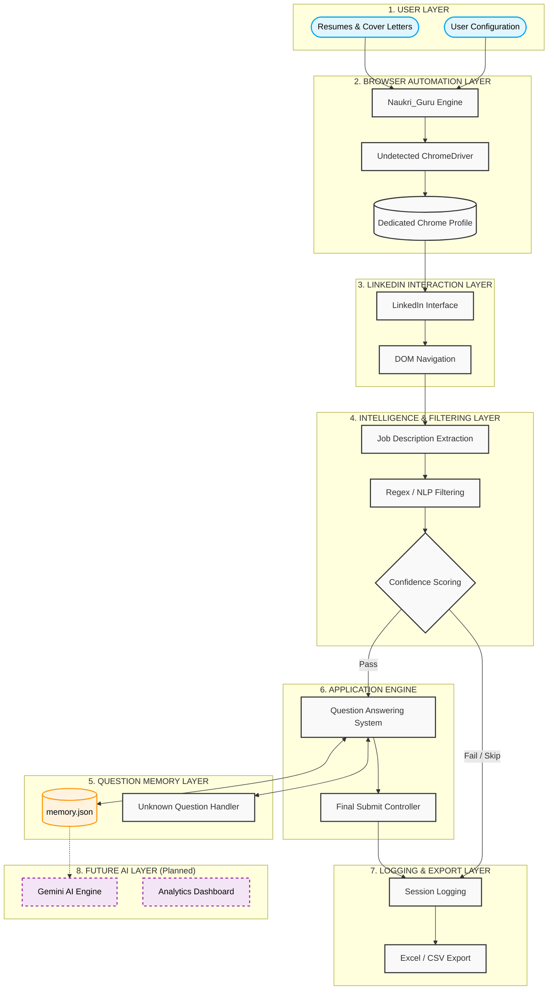
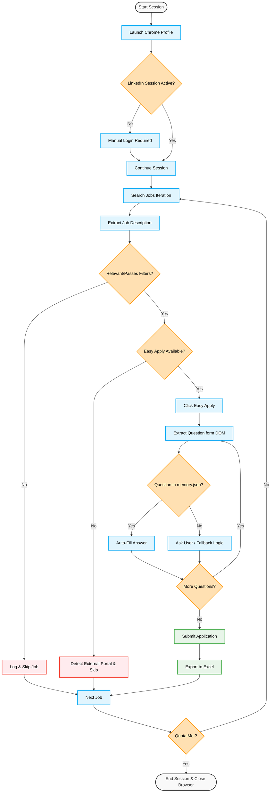
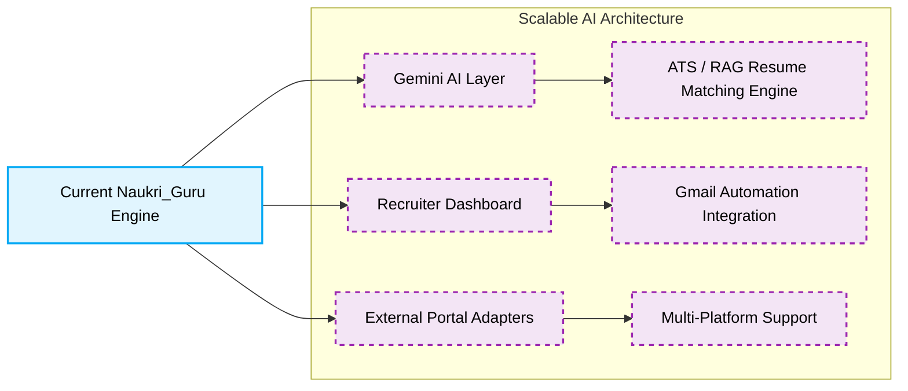

# Naukri_Guru Architecture & Pipeline

## SECTION A — SYSTEM ARCHITECTURE DIAGRAM

The Naukri_Guru system is structured into clearly separated layers. This modular design isolates browser interactions from application logic, making the platform robust against LinkedIn UI changes and ready for scalable AI integration.

---

## SECTION B — EXECUTION PIPELINE FLOWCHART

This flowchart demonstrates the exact step-by-step decision matrix the Naukri_Guru engine follows during a live run. It highlights the platform's ability to gracefully handle missing data, skipped jobs, and dynamic question generation.

---

## SECTION C — DATA NORMALIZATION & SCHEMA LAYER

To ensure high-fidelity analytics and cross-platform compatibility, Naukri_Guru implements a robust **Centralized Data Normalization Layer**.

*   **Schema Consistency**: Master schemas defined in `modules/helpers.py` ensure that every row in the historical CSVs and Excel exports follows a strict column order and count.
*   **Safe Migration**: The platform automatically detects legacy data structures (e.g., from older versions of the bot) and migrates them to the current schema on-the-fly, preventing data corruption and runtime crashes.
*   **Normalization Pipeline**: All data written to the analytics layer is passed through a `normalize_row` function that handles missing fields, data truncation, and type-safety.

---

## SECTION D — FUTURE ARCHITECTURE ROADMAP

To scale from a heuristic-based automation script to a full AI automation platform, the following architectural upgrades are planned.

*Note: Highlighted nodes represent Future Enhancements — Not Yet Implemented.*

---

## SECTION D — TECHNOLOGY STACK

* **Python 3.x:** Core application orchestration and execution engine.
* **Selenium / Undetected ChromeDriver:** Enables stealth browser manipulation, evading standard bot-detection systems by masking WebDriver footprints.
* **JSON Memory (`memory.json`):** A lightweight, low-latency NoSQL dictionary used for stateful retention of historical application answers.
* **Regex / NLP Processing:** Heuristic rules-engine parsing raw text from DOM nodes for immediate filtering.
* **Pandas / OpenPyXL:** Standardizes log handling and outputs robust presentation-ready Excel tracking documents with support for jagged CSV normalization.
* **Mermaid:** Used natively for programmatic, reproducible architecture charting.
